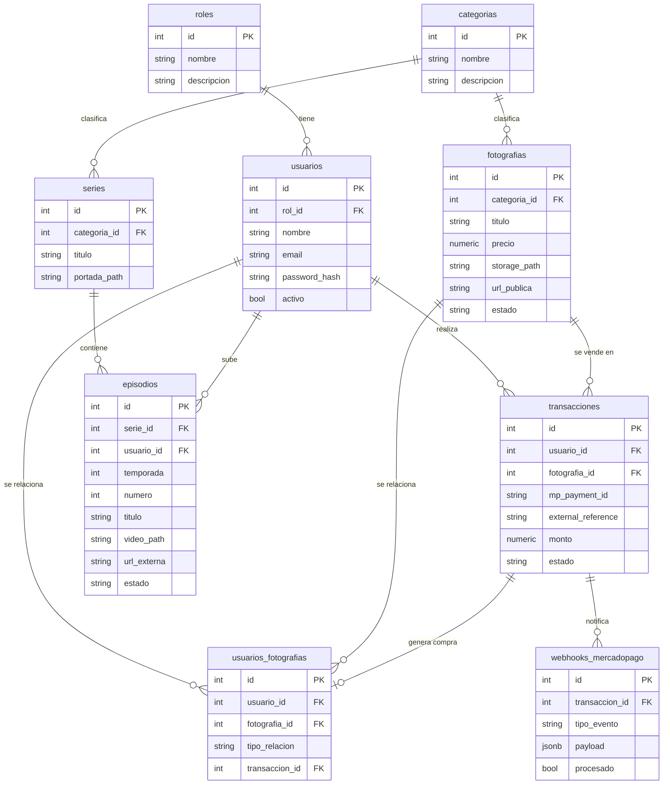

# Diagrama entidad-relación

```mermaid
erDiagram
    roles ||--o{ usuarios : "tiene"
    usuarios ||--o{ usuarios_fotografias : "se relaciona"
    fotografias ||--o{ usuarios_fotografias : "se relaciona"
    categorias ||--o{ fotografias : "clasifica"
    categorias ||--o{ series : "clasifica"
    usuarios ||--o{ transacciones : "realiza"
    fotografias ||--o{ transacciones : "se vende en"
    transacciones ||--o{ webhooks_mercadopago : "notifica"
    transacciones ||--o| usuarios_fotografias : "genera compra"
    series ||--o{ episodios : "contiene"
    usuarios ||--o{ episodios : "sube"

    roles {
        int id PK
        string nombre
        string descripcion
    }
    usuarios {
        int id PK
        int rol_id FK
        string nombre
        string email
        string password_hash
        bool activo
    }
    categorias {
        int id PK
        string nombre
        string descripcion
    }
    fotografias {
        int id PK
        int categoria_id FK
        string titulo
        numeric precio
        string storage_path
        string url_publica
        string estado
    }
    usuarios_fotografias {
        int id PK
        int usuario_id FK
        int fotografia_id FK
        string tipo_relacion
        int transaccion_id FK
    }
    transacciones {
        int id PK
        int usuario_id FK
        int fotografia_id FK
        string mp_payment_id
        string external_reference
        numeric monto
        string estado
    }
    webhooks_mercadopago {
        int id PK
        int transaccion_id FK
        string tipo_evento
        jsonb payload
        bool procesado
    }
    series {
        int id PK
        int categoria_id FK
        string titulo
        string portada_path
    }
    episodios {
        int id PK
        int serie_id FK
        int usuario_id FK
        int temporada
        int numero
        string titulo
        string video_path
        string url_externa
        string estado
    }
```
